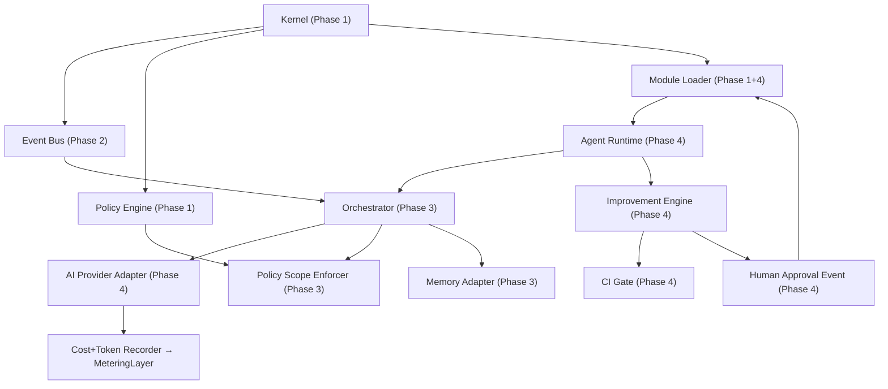

# Phase 3 & 4: Enhanced Implementation Plan
## Agent Composition, Orchestration & Runtime

> Built on the Phase 1-2 hardened kernel (131 tests passing, 98% coverage, 0 bandit findings).

---

## Critical Engineering Gaps Identified

### 🔴 SPEC GAPS — Phase 3

| # | Gap | Severity | Resolution |
|---|---|---|---|
| G3-01 | `AgentTaskSpec` event payload has no `context`, `timeout_seconds`, or `correlation_id` fields | HIGH | Extend `agent.task_submitted` schema |
| G3-02 | No `AgentStatus` enum — task lifecycle undefined (PENDING→RUNNING→COMPLETED→FAILED) | HIGH | Add `AgentTaskStatus` enum to [types.py](file:///c:/Users/sergi/colony/backend/col/engine/coe-kernel/core/types.py) |
| G3-03 | "Policy Scope" binding mechanism not specified — no mapping format between agent role and capability subset | HIGH | Add `PolicyScopeBinding` dataclass + loader |
| G3-04 | `MemoryAdapterInterface` has no defined read/write operations, only "null_memory" mentioned | MEDIUM | Define full `MemoryAdapterInterface` with [store](file:///c:/Users/sergi/colony/backend/col/engine/coe-kernel/core/secrets/vault.py#57-83)/[retrieve](file:///c:/Users/sergi/colony/backend/col/engine/coe-kernel/core/secrets/vault.py#132-184)/`clear` |
| G3-05 | No `AIProviderInterface` ABC — only prose description; no generate() signature, history format, or return model | HIGH | Define `AIProviderInterface` + `AIResponse`, `AIMessage` types |
| G3-06 | Orchestrator reasoning loop has no `correlation_id` threading — breaks Phase 2 event traceability | HIGH | Orchestrator must propagate `correlation_id` through all emitted events |
| G3-07 | No `agent.task_completed` or `agent.task_failed` event schemas defined | HIGH | Define both schemas in [SchemaRegistry](file:///c:/Users/sergi/colony/backend/col/engine/coe-kernel/core/event_bus/bus.py#19-64) |
| G3-08 | No `AgentOrchestratorInterface` ABC — cannot mock for tests | MEDIUM | Add ABC to [interfaces.py](file:///c:/Users/sergi/colony/backend/col/engine/coe-kernel/core/interfaces.py) |
| G3-09 | Token metering for AI calls not wired to [MeteringLayer](file:///c:/Users/sergi/colony/backend/col/engine/coe-kernel/core/metering/node.py#13-113) | HIGH | Record `ai_tokens` metric via `metering.record()` after each provider call |

### 🔴 SPEC GAPS — Phase 4

| # | Gap | Severity | Resolution |
|---|---|---|---|
| G4-01 | `AgentRuntime` has no registration protocol — no `agent.registered` event, no persistence | HIGH | Add `AgentRegistry` with [register()](file:///c:/Users/sergi/colony/backend/col/engine/coe-kernel/core/event_bus/bus.py#26-43), `unregister()`, hot-swap via Event Bus |
| G4-02 | `LLMProvider.generate()` signature is incomplete — no history, no system_prompt, no timeout, no cost return | HIGH | Full `AIProviderInterface.generate(prompt, history, config) -> AIResponse` |
| G4-03 | Module Loader in Phase 4 adds `permissions` + [events](file:///c:/Users/sergi/colony/backend/col/engine/coe-kernel/core/event_bus/store.py#173-201) to manifest — Phase 1 loader doesn't validate these | HIGH | Extend `ModuleLoader._validate_manifest()` + `register_module_subscriptions()` |
| G4-04 | `ImprovementEngine` has no patch format — "produce diff" is undefined | HIGH | Define `Patch` dataclass: [(patch_id, target_module, unified_diff, test_vector, proposed_by)](file:///c:/Users/sergi/colony/backend/col/engine/coe-kernel/core/module_loader/loader.py#122-203) |
| G4-05 | Improvement engine "CI Engine → Run Tests" step is unspecified — no `CIGateInterface` | HIGH | Add `CIGateInterface` with `run_tests(patch) -> CIResult` |
| G4-06 | "Human Approve" step has no event model — patch approval is not auditable | HIGH | Add `improvement.patch_proposed`, `improvement.patch_approved`, `improvement.patch_rejected` events |
| G4-07 | Hot-swap protocol undefined — how does module unload + reload atomically? | HIGH | Add `ModuleLoader.hot_swap(name, new_manifest_path)` with rollback on failure |
| G4-08 | No `AgentRuntimeInterface` ABC — agents are not mockable | MEDIUM | Add ABC to [interfaces.py](file:///c:/Users/sergi/colony/backend/col/engine/coe-kernel/core/interfaces.py) |
| G4-09 | Provider adapter cost tracking has no `CostLedger` — "cost tracking increments" is undefined | MEDIUM | Add `ProviderCallRecord(tokens_in, tokens_out, cost_usd, provider_id)` to types + record via metering |
| G4-10 | "Temperature forced to 0 in system_mode" — no `system_mode` concept defined anywhere | MEDIUM | Add `RuntimeMode(SYSTEM, USER)` enum; system mode forces `temperature=0` in provider config |
| G4-11 | `ImprovementEngine` kernel/policy protection: "Cannot modify kernel" is a prose constraint with no enforcement | CRITICAL | Add `PROTECTED_PATHS` blocklist; reject any `Patch.target_module` that matches protected paths |

### 🟡 HAPPY PATH MISSING ELEMENTS

The Phase 4 happy path (§7) is incomplete:
- No `correlation_id` threading across the 8-step chain
- No failure/rollback path shown
- No event sequence numbers specified
- No audit checkpoint at each step

---

## Architecture: Phase 3 + 4 Component Map



---

## Proposed Changes

### Phase 3 Core — New Module: `core/agent/`

#### [NEW] `core/agent/__init__.py`
Empty package marker.

#### [NEW] `core/agent/types.py`
```python
# New types required by Phase 3 and 4
@dataclass(frozen=True)
class AgentTaskSpec:
    task_id: UUID
    agent_id: UUID
    instruction: str
    constraints: AgentConstraints
    correlation_id: UUID          # GAP G3-06: required for event traceability
    context: Dict[str, Any]       # GAP G3-01: missing from original spec

@dataclass(frozen=True)
class AgentConstraints:
    max_reasoning_steps: int      # Hard loop upper bound
    max_tokens: int
    timeout_seconds: int          # GAP G3-01: missing from original spec
    deterministic_mode: bool

class AgentTaskStatus(Enum):      # GAP G3-02: undefined in spec
    PENDING = "pending"
    RUNNING = "running"
    COMPLETED = "completed"
    FAILED = "failed"
    EXCEEDED = "exceeded"         # max_reasoning_steps hit

@dataclass(frozen=True)
class AgentTaskResult:
    task_id: UUID
    status: AgentTaskStatus
    steps_taken: int
    final_output: Optional[str]
    error: Optional[str]

@dataclass(frozen=True)
class AIMessage:
    role: str                     # "system" | "user" | "assistant"
    content: str

@dataclass(frozen=True)
class AIResponse:
    content: str
    tokens_in: int
    tokens_out: int
    cost_usd: float               # GAP G4-09
    provider_id: str

@dataclass(frozen=True)
class Patch:                      # GAP G4-04
    patch_id: UUID
    target_module: str
    unified_diff: str
    test_vector: str              # Pytest command to run
    proposed_by: str              # agent identity_id
    status: str                   # "proposed" | "approved" | "rejected" | "applied"
```

#### [NEW] `core/agent/orchestrator.py`
- `Orchestrator` class implementing `AgentOrchestratorInterface`
- Hard `for step in range(max_steps)` loop — no `while` allowed
- Every emitted event carries `correlation_id` from task spec
- On `PolicyDecision(allowed=False)` → immediately emit `agent.task_failed`, return
- On loop exhaustion → emit `agent.task_failed` with `status=EXCEEDED`
- Token metering: `metering.record(agent_id, "ai_tokens", response.tokens_in + tokens_out)`

#### [NEW] `core/agent/memory.py`
- `NullMemory` (Phase 3 default): [store()](file:///c:/Users/sergi/colony/backend/col/engine/coe-kernel/core/secrets/vault.py#57-83) → no-op, [retrieve()](file:///c:/Users/sergi/colony/backend/col/engine/coe-kernel/core/secrets/vault.py#132-184) → `None`
- `InMemoryAdapter`: dict-backed, scoped per task via `correlation_id`
- Both implement `MemoryAdapterInterface`

#### [NEW] `core/agent/scope_enforcer.py`
- `PolicyScopeEnforcer`: loads `PolicyScopeBinding` from config
- Wraps `PolicyEngineInterface.evaluate()` — adds scope context to every check
- Raises [KernelError(POLICY_DENIED)](file:///c:/Users/sergi/colony/backend/col/engine/coe-kernel/core/errors.py#60-78) immediately if capability is outside agent's declared scope

---

### Phase 4 Core — New Modules

#### [NEW] `core/agent_runtime/runtime.py`
- `AgentRuntime`: implements `AgentRuntimeInterface`
- [register(agent_def: AgentDefinition)](file:///c:/Users/sergi/colony/backend/col/engine/coe-kernel/core/event_bus/bus.py#26-43) → creates identity, allocates metering budget, emits `agent.registered`
- `unregister(agent_id)` → revokes identity, emits `agent.unregistered`, audits
- [execute(task_spec)](file:///c:/Users/sergi/colony/backend/col/engine/coe-kernel/core/event_bus/bus.py#95-122) → delegates to `Orchestrator`, wraps in try/except catching all `Exception` subclasses
- **G4-01 resolved**: `AgentRegistry` dict keyed by `agent_id`, survives restart via audit reconstruction

#### [NEW] `core/agent_runtime/provider_adapters/base.py`
- `AIProviderInterface` ABC:
  ```python
  def generate(
      self,
      prompt: str,
      history: List[AIMessage],
      config: ProviderConfig,
  ) -> AIResponse: ...
  ```
- **G4-02 resolved**: full signature with history + config
- `ProviderConfig(temperature, max_tokens, timeout_seconds, system_mode: RuntimeMode)`
- **G4-10 resolved**: `RuntimeMode.SYSTEM` forces `temperature=0.0`

#### [NEW] `core/agent_runtime/provider_adapters/null_provider.py`
- Returns deterministic `AIResponse(content="NULL_PROVIDER_RESPONSE", tokens_in=0, tokens_out=0)`
- Used for Phase 3 testing and CI

#### [NEW] `core/agent_runtime/provider_adapters/mock_provider.py`
- Takes a `responses: List[str]` queue; pops in order → deterministic for tests
- Raises [KernelError(UNKNOWN_FAULT)](file:///c:/Users/sergi/colony/backend/col/engine/coe-kernel/core/errors.py#60-78) on exhaustion

#### [MODIFY] [core/module_loader/loader.py](file:///c:/Users/sergi/colony/backend/col/engine/coe-kernel/core/module_loader/loader.py)
- Extend `_validate_manifest()` to check `permissions` and [events](file:///c:/Users/sergi/colony/backend/col/engine/coe-kernel/core/event_bus/store.py#173-201) fields — **G4-03**
- Add `register_module_subscriptions(name, event_bus)` — subscribes module to its declared events
- Add `hot_swap(module_name, new_manifest_path)` — **G4-07**: loads new version, tests healthcheck, rolls back if fails, audits result

#### [NEW] `core/improvement_engine/engine.py`
- `ImprovementEngine` implements `ImprovementEngineInterface`
- `propose_patch(patch: Patch)` → validates target not in `PROTECTED_PATHS` — **G4-11**
- Emits `improvement.patch_proposed` event with `patch_id`
- `approve_patch(patch_id, approver_id)` → validates approver identity role, invokes `CIGateInterface.run_tests()`
- On CI pass → calls `module_loader.hot_swap()`, emits `improvement.patch_applied`
- On CI fail → emits `improvement.patch_rejected`

#### [NEW] `core/improvement_engine/ci_gate.py`
- `LocalCIGate` implements `CIGateInterface`
- **G4-05 resolved**: `run_tests(patch: Patch) -> CIResult`
- Executes `patch.test_vector` as subprocess in sandbox
- Returns `CIResult(passed, duration_ms, output)`

---

### Updated [core/interfaces.py](file:///c:/Users/sergi/colony/backend/col/engine/coe-kernel/core/interfaces.py)

#### 5 new ABCs to add:

```python
class AgentOrchestratorInterface(ABC):               # GAP G3-08
    def execute(self, task: AgentTaskSpec) -> AgentTaskResult: ...
    def get_active_tasks(self) -> List[UUID]: ...

class AIProviderInterface(ABC):                      # GAP G3-05, G4-02
    def generate(self, prompt, history, config) -> AIResponse: ...

class MemoryAdapterInterface(ABC):                   # GAP G3-04
    def store(self, key: str, value: Any, scope_id: UUID) -> None: ...
    def retrieve(self, key: str, scope_id: UUID) -> Optional[Any]: ...
    def clear(self, scope_id: UUID) -> None: ...

class AgentRuntimeInterface(ABC):                    # GAP G4-08
    def register(self, agent_def: AgentDefinition) -> Identity: ...
    def unregister(self, agent_id: UUID) -> None: ...
    def execute(self, task: AgentTaskSpec) -> AgentTaskResult: ...

class ImprovementEngineInterface(ABC):               # GAP G4-05
    def propose_patch(self, patch: Patch) -> None: ...
    def approve_patch(self, patch_id: UUID, approver_id: str) -> None: ...
    def reject_patch(self, patch_id: UUID, reason: str) -> None: ...

class CIGateInterface(ABC):                          # GAP G4-05
    def run_tests(self, patch: Patch) -> CIResult: ...
```

### New Error Codes

```python
# Agent errors (8xxx)
AGENT_NOT_REGISTERED = "8001"
AGENT_TASK_POLICY_DENIED = "8002"
AGENT_MAX_STEPS_EXCEEDED = "8003"
AGENT_PROVIDER_TIMEOUT = "8004"
AGENT_CAPABILITY_OUT_OF_SCOPE = "8005"

# Improvement Engine errors (10xxx)
PATCH_TARGET_PROTECTED = "10001"  # nosec B105
PATCH_CI_FAILED = "10002"         # nosec B105
PATCH_NOT_FOUND = "10003"         # nosec B105
```

### New Event Schemas to Register

| Event Type | Required Fields | Phase |
|---|---|---|
| `agent.registered` | `agent_id`, [role](file:///c:/Users/sergi/colony/backend/col/engine/coe-kernel/core/interfaces.py#68-71), [capabilities](file:///c:/Users/sergi/colony/backend/col/engine/coe-kernel/core/interfaces.py#68-71) | 4 |
| `agent.unregistered` | `agent_id` | 4 |
| `agent.task_submitted` | full `AgentTaskSpec` | 3 |
| `agent.task_completed` | `task_id`, `steps_taken`, `output` | 3 |
| `agent.task_failed` | `task_id`, `reason`, `step_at_failure` | 3 |
| `improvement.patch_proposed` | `patch_id`, `target_module`, `proposed_by` | 4 |
| `improvement.patch_approved` | `patch_id`, `approver_id` | 4 |
| `improvement.patch_applied` | `patch_id`, `module_version` | 4 |
| `improvement.patch_rejected` | `patch_id`, `reason` | 4 |

---

## ✅ Full Happy Path — Phase 3 + 4 (with correlation threading)

```
correlation_id = uuid4()

1. [AgentRuntime] register("cole", role="planner", capabilities=["plan","analyze"])
   → Identity created via IdentityService
   → Budget allocated: MeteringLayer.allocate(cole_id, "ai_tokens", 10000)
   → Event: agent.registered {agent_id, role, correlation_id}
   → Audit: agent_registered SUCCESS

2. [ModuleLoader] load("crm_module")
   → Validate manifest (permissions + events)
   → AST scan (forbidden imports blocked)
   → register_module_subscriptions("crm_module", event_bus)
   → Module.initialize(kernel_ctx)
   → Event: module.loaded {name, version}
   → Audit: module_loaded SUCCESS

3. [EventBus] publish(agent.task_submitted) with correlation_id
   → SchemaRegistry validates payload
   → Event signed and sequenced
   → Orchestrator subscriber receives

4. [Orchestrator] execute(task_spec)
   → for step in range(max_reasoning_steps=5):
       a. PolicyScopeEnforcer.check(agent_id, "plan") → ALLOW
       b. AIProvider.generate(prompt, history, config)
          → MeteringLayer.record(cole_id, "ai_tokens", tokens_used)
          → If tokens exceeded → MeteringLayer emits system.budget_exceeded
       c. Parse AI response for capability request
       d. PolicyEngine.evaluate(cole_id, capability) → ALLOW/DENY
       e. If ALLOW: EventBus.publish(capability event, correlation_id)
          → CRM Module subscriber receives, processes, responds
       f. If action == "complete": break
   → On completion: EventBus.publish(agent.task_completed, correlation_id)
   → Audit: agent_task_completed SUCCESS

5. [ImprovementEngine] propose_patch(Patch(target="crm_module", ...))
   → Protected path check: "crm_module" ∉ PROTECTED_PATHS → PASS
   → PolicyEngine.evaluate(cole_id, "propose_improvement") → ALLOW
   → Event: improvement.patch_proposed {patch_id, correlation_id}
   → Audit: patch_proposed SUCCESS

6. [Human] approve via external trigger → improvement.patch_approved event
   → ImprovementEngine.approve_patch(patch_id, approver_id="human_admin")
   → CIGate.run_tests(patch) → CIResult(passed=True)
   → ModuleLoader.hot_swap("crm_module", new_path)
   → Event: improvement.patch_applied {patch_id, new_version}
   → Audit: patch_applied SUCCESS

7. All audit entries verifiable via AuditLedger.verify_integrity() → True
   All events correlated via same correlation_id
   No policy violation recorded
```

---

## New Directory Layout

```
coe-kernel/core/
├── agent/                        # Phase 3 [NEW]
│   ├── __init__.py
│   ├── orchestrator.py           # Finite Orchestrator + scope enforcer
│   ├── memory.py                 # NullMemory, InMemoryAdapter
│   ├── scope_enforcer.py         # PolicyScopeBinding + enforcer
│   └── types.py                  # AgentTaskSpec, AgentConstraints, AIMessage, etc.
├── agent_runtime/                # Phase 4 [NEW]
│   ├── __init__.py
│   ├── runtime.py                # AgentRuntime + AgentRegistry
│   └── provider_adapters/
│       ├── __init__.py
│       ├── base.py               # AIProviderInterface, ProviderConfig, RuntimeMode
│       ├── null_provider.py      # Deterministic stub
│       └── mock_provider.py      # Queueable mock for tests
├── improvement_engine/           # Phase 4 [NEW]
│   ├── __init__.py
│   ├── engine.py                 # ImprovementEngine
│   └── ci_gate.py                # LocalCIGate + CIResult
├── module_loader/
│   └── loader.py                 # [MODIFY] + manifest permissions, hot_swap
├── errors.py                     # [MODIFY] add 8xxx and 10xxx ranges
├── interfaces.py                 # [MODIFY] add 5 new ABCs
└── types.py                      # [MODIFY] add Phase 3&4 types
```

---

## Test Requirements

### Phase 3 Tests (`tests/test_orchestrator.py`)
- [ ] Orchestrator terminates at `max_reasoning_steps` — `AgentTaskStatus.EXCEEDED`
- [ ] Policy denial at any step → `agent.task_failed` immediately
- [ ] All events in task share same `correlation_id`
- [ ] Token metering increments on each AI call
- [ ] `NullMemory` store/retrieve returns None
- [ ] `InMemoryAdapter` isolates by `scope_id`

### Phase 4 Tests (`tests/test_agent_runtime.py`)
- [ ] Agent cannot execute without policy token
- [ ] Agent cannot use undefined capability
- [ ] Agent cannot exceed token limit
- [ ] `NullProvider` returns deterministic response
- [ ] `MockProvider` pops queue in order, raises on exhaustion
- [ ] Temperature forced to 0.0 in `RuntimeMode.SYSTEM`
- [ ] Module loader rejects manifest missing `permissions` field
- [ ] `hot_swap` rolls back on failed healthcheck
- [ ] `ImprovementEngine` rejects patch targeting `PROTECTED_PATHS`
- [ ] `ImprovementEngine` reject patch with no unified_diff
- [ ] `LocalCIGate` returns `CIResult(passed=True)` for valid patches
- [ ] `approve_patch` emits `improvement.patch_applied` after CI pass
- [ ] Full happy path: Register → Submit Task → Complete → Propose Patch → Approve → Apply

---

## Integration Points with Phase 1-2

| Phase 3/4 Component | Binds To | How |
|---|---|---|
| `Orchestrator` | [EventBusInterface](file:///c:/Users/sergi/colony/backend/col/engine/coe-kernel/core/interfaces.py#132-161) | Publishes all agent events |
| `Orchestrator` | [PolicyEngineInterface](file:///c:/Users/sergi/colony/backend/col/engine/coe-kernel/core/interfaces.py#92-108) | Evaluates every AI-generated capability |
| `Orchestrator` | [MeteringInterface](file:///c:/Users/sergi/colony/backend/col/engine/coe-kernel/core/interfaces.py#163-181) | Records `ai_tokens` per reasoning step |
| `Orchestrator` | [AuditLedgerInterface](file:///c:/Users/sergi/colony/backend/col/engine/coe-kernel/core/interfaces.py#14-30) | Logs each step start/end |
| `AgentRuntime` | [IdentityServiceInterface](file:///c:/Users/sergi/colony/backend/col/engine/coe-kernel/core/interfaces.py#32-90) | Creates agent identity on registration |
| `AgentRuntime` | [StateEngineInterface](file:///c:/Users/sergi/colony/backend/col/engine/coe-kernel/core/interfaces.py#183-209) | Optional FSM for task lifecycle tracking |
| `ImprovementEngine` | [ModuleLoaderInterface](file:///c:/Users/sergi/colony/backend/col/engine/coe-kernel/core/interfaces.py#211-229) | `hot_swap` on approved patch |
| `ImprovementEngine` | [AuditLedgerInterface](file:///c:/Users/sergi/colony/backend/col/engine/coe-kernel/core/interfaces.py#14-30) | Logs every patch lifecycle event |
| `AIProvider` | [SecretsVaultInterface](file:///c:/Users/sergi/colony/backend/col/engine/coe-kernel/core/interfaces.py#110-130) | Retrieves API keys securely |
| Module Loader | [EventBusInterface](file:///c:/Users/sergi/colony/backend/col/engine/coe-kernel/core/interfaces.py#132-161) | Auto-subscribes module to its declared events |

---

## Verification Plan

### Automated Tests
```bash
pytest tests/test_orchestrator.py -v --tb=short
pytest tests/test_agent_runtime.py -v --tb=short
pytest tests/ --cov=core --cov-report=term-missing
python -m mypy --strict core
bandit -r core -q
```

### Zero-Tolerance Checks
- `# nosec` annotations only on confirmed false positives (B105 on error code values)
- No `while True` or unbounded recursion anywhere in agent paths
- Every `agent.*` event must carry `correlation_id`
- `PROTECTED_PATHS = {"core/main.py", "core/policy/", "core/audit/"}` enforced in `ImprovementEngine`
- No direct AI provider calls from orchestrator — must go through `AIProviderInterface`
